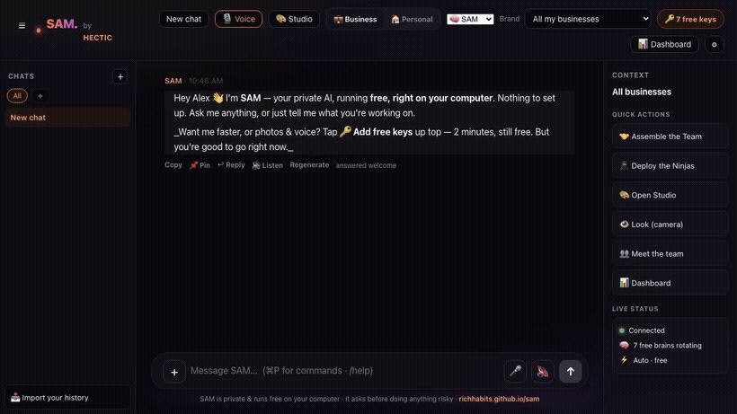

<div align="center">

# S.A.M. — Smart Artificial Mind

**A free, private team of AI agents that lives on your computer, remembers everything, and actually does the work. No subscription, no cost — runs on free cloud AI tiers by default, or 100% offline on Ollama.**

Not a chatbot. A doer — with a *crew*. SAM researches, remembers, and takes real action on your computer (web, files, terminal, email, calls, GitHub), and when a job's big it assembles a **team of specialist agents** to tackle it in parallel — all running free on your own machine.

`Free forever` · `Local-first & private` · `40 free AI brains` · `A team of agents` · `Ask-first safe`

**Works everywhere: macOS · Windows · Linux** — [see the platform matrix](docs/PLATFORMS.md)

</div>

<p align="center">
      
</p>

<div align="center">

```bash
curl -fsSL https://richhabits.github.io/sam/install.sh | bash
```
**macOS · Linux — one paste.** Windows: `irm https://richhabits.github.io/sam/install.ps1 | iex`

<!-- Hero demo — regenerated by scripts/record-demo.mjs. Shows SAM's real edge: it remembers YOU —
     tell it about your brand, then it writes using what it learned, no re-explaining. -->


⭐ **[Star SAM](https://github.com/richhabits/sam)** if you want a free, private AI that actually does the work.

</div>

---

## 🚀 New in v1.4 "Game Changer"

*What Cursor did to coding, SAM does to the whole computer.* And it's now **~86% cheaper and ~46% faster per task** than v1.3 — with **every task served free-or-local** ([reproducible benchmarks](docs/BENCHMARKS.md)).

- 🧠 **Cascade brain** — a classifier routes each request to the cheapest brain that fits (trivial → your local model, never a paid API), auto-escalating only when a cheap answer actually fails. **~35% fewer tokens**, free-first always.
- ⚡ **Semantic cache** — ask the same thing twice and SAM answers **from memory in ~2ms, 0 tokens**.
- 🗂️ **The life index** — pick folders and SAM indexes them **on-device**, keeps them fresh, and cites the file in its answers. *Cursor indexes your repo; SAM indexes your world.*
- 🪄 **SAM everywhere** — hit **Alt+Space** (**⌥Space** on Mac) over any app, highlight text, and rewrite / reply / summarize / translate / fix it in place.
- 🛠️ **The forge** — when SAM lacks a tool, it **writes one** — sandbox-tested, saved disabled for you to review + enable.

## Why SAM

Most "AI assistants" just talk. SAM works:

- 🤝 **A team of AI agents** — for a big job SAM assembles a crew (research, code, writing, strategy, growth, deals) that runs **in parallel** and synthesises one answer. Plus **🥷 the Ninjas** — a problem squad that hunts down blockers, debts and loose ends.
- 🐝 **The Swarm** — long-running, continuous background agents that survive restarts and pause to ask for your approval on risky actions.
- 🧠 **40 free AI brains, auto-rotating** — Groq · Cerebras · NVIDIA · DeepSeek · Gemini · Mistral · GitHub Models · SambaNova · Together · Fireworks · and 20 more. One hits a limit, it hops to the next.
- 📐️ **175 real tools** — web, files, terminal, email, iMessage, calls, calendar, music, camera & vision, screenshots, **GitHub (read, commit, push, PRs)**.
- ⏰ **Scheduled Tasks** — run background routines on a cron (hourly, daily, weekly) e.g., `/schedule daily 09:00 | summarize the news`.
- 📱 **iOS Companion** — drop notes to SAM from your iPhone/Watch via an iCloud folder; text notes are processed instantly, voice memos when Whisper is installed.
- 💻 **Native desktop app** — Mac/Windows/Linux desktop UI with a global **Alt+Space** (`⌥Space` on Mac) hotkey to summon SAM anywhere. Build it with `npm run build:mac` (or `:win` / `:linux`). Note: package the app from a **path with no spaces** — native modules can't build otherwise (the web app has no such restriction).
- ✈️ **Autopilot** — lifts the routine work autonomously; the serious stuff still asks. And it reaches out first with a **morning brief** + nudges.
- 👁️ **It can see** — looks through your camera, knows your people by sight (*"hey Alex"*), and **🛡️ Guardian** mode watches for intruders.
- 🧭 **Semantic memory** · 💼🏠 **Business & Personal minds** · 📍 **live progress tracker** · 🗣️ **two-way voice**.
- 🎨 **Skins** — Jarvis HUD, Ember, Stealth. Clean premium UI, light/dark, streams as it types.
- 🔒 **Private by design** — your keys, memory, vault and documents stay on your machine. Only the prompt you send goes to the brain you pick (and nothing at all in offline/Ollama mode).

### SAM vs the usual options

|  | **SAM** | ChatGPT Desktop | Typical open chat UI |
|---|:---:|:---:|:---:|
| **Cost** | Free (£0/mo) | $20/mo | Free |
| **Runs on your machine** | ✅ | ❌ cloud | ✅ |
| **Works fully offline** | ✅ (Ollama) | ❌ | ⚠️ if you self-host a model |
| **Takes real actions** | ✅ 173 tools | ⚠️ limited | ❌ mostly chat |
| **Team of agents** | ✅ parallel crew | ❌ | ❌ |
| **Your data stays home** | ✅ | ❌ | ✅ |
| **Free brains, auto-rotating** | ✅ ~40 | n/a | ❌ bring your own |
| **One-paste install** | ✅ | ✅ | ❌ usually setup |
| **Telemetry** | none | yes | varies |

---

## Quick start

### ⚡ One paste — install & launch (about 60 seconds)

**macOS / Linux:**
```bash
curl -fsSL https://richhabits.github.io/sam/install.sh | bash
```
**Windows (PowerShell):**
```powershell
irm https://richhabits.github.io/sam/install.ps1 | iex
```
Detects your OS, downloads the right build, **verifies the SHA-256**, installs it, and launches SAM. Re-run any time to update. Then open **http://localhost:8787** — free out of the box, no key or setup.

*(macOS also: `brew install --cask richhabits/tap/sam`.)*

### ⬇️ Prefer a click? Download the app (no terminal)

**[Download SAM](https://github.com/richhabits/sam/releases/latest)** — works free out of the box, no API key needed:
- **Mac** (Apple Silicon M1–M4): open the `.dmg` → drag **SAM** to Applications → launch it. On recent macOS an unsigned app shows *"SAM is damaged and can't be opened"* — that's **not** real damage, just Apple's quarantine flag on a browser download. One-line fix: `xattr -cr /Applications/SAM.app` in Terminal (then open it), or **System Settings → Privacy & Security → Open Anyway**. *(The one-paste installer above strips this automatically; code-signing removes it for good.)*
- **Windows**: run `SAM-Setup-…exe` → if SmartScreen appears, click **More info → Run anyway** (once — it's unsigned)

> **"Windows says the file isn't safe" / "Windows protected your PC" — that's expected, and it's not actually unsafe.** It's the exact same build our CI tests; Windows just shows this for any app that isn't code-signed (a paid publisher certificate), until the app builds download reputation. To proceed: if your browser flags the download, choose **Keep**; when the blue SmartScreen box appears, click **More info → Run anyway**. (Mac shows a *"damaged"* variant on recent macOS — `xattr -cr /Applications/SAM.app` or Privacy & Security → Open Anyway; see the Mac note above.) The permanent fix is code-signing — see below.

### 🔒 Verify your download

Every release ships **SHA-256 checksums** in its notes (auto-generated by CI). To confirm your installer wasn't tampered with, compute the hash and match it:

- **macOS / Linux:** `shasum -a 256 SAM-*.dmg`
- **Windows (PowerShell):** `Get-FileHash SAM-Setup-*.exe -Algorithm SHA256`

The builds are currently **unsigned** (the one-time "unverified app" warning is expected — see above). Removing that warning needs a code-signing certificate; the exact steps + costs are in **[docs/SIGNING.md](docs/SIGNING.md)**, and CI signs automatically the moment the certs are added.

### 🛠️ Or run from source (Mac · Windows · Linux)

**Prerequisites:** [Node.js 20.19+ or 22.12+](https://nodejs.org) — *or skip this: `./setup.sh` installs it for you.*

Paste these into Terminal **exactly as-is** (they're clean — no comments to trip up zsh):

```bash
git clone https://github.com/richhabits/sam.git
cd sam
npm install
cp .env.example .env
npm start
```

Then open **http://localhost:8787**, tell SAM your name, and go — **SAM works free out of the box, no key needed.** Want more speed or image/video? Add a free key in **⚙ Settings** (optional — never required, and never by editing files).

> **Mac / Linux** — prefer one command? `git clone https://github.com/richhabits/sam.git && cd sam && ./setup.sh`
>
> ⚠️ **Windows — do NOT use that one-liner.** Windows PowerShell doesn't understand `&&`, and `./setup.sh` is a Mac/Linux script (you'll get `The token '&&' is not a valid statement separator`). Instead, **the easiest path on Windows is the [Download button](#-easiest--download-the-app-no-terminal-nothing-to-install) — no terminal at all.** If you really want source: run the commands **one line at a time** in PowerShell:
> ```powershell
> git clone https://github.com/richhabits/sam.git
> cd sam
> npm install
> npm start
> ```
> (or `.\setup.ps1`). Then double-click **`START-SAM.bat`** to launch any time.

> No keys? You don't need any — SAM runs **free out of the box**. For a fully-offline brain, install [Ollama](https://ollama.com); for more speed/power, add a free key in Settings (optional — 60 seconds).

---

## Get a free brain (pick any — all free)

> 👶 **Want dead-simple, step-by-step instructions?** See **[FREE-BRAINS.md](FREE-BRAINS.md)** — the
> baby-steps guide: ~15 minutes of copy-paste gets you fast, free AI that basically never runs out.

Open **⚙ Settings → API keys** in the app and paste one or more. SAM rotates across all of them.

| Provider | Get a key | Notes |
|---|---|---|
| **Groq** | [console.groq.com/keys](https://console.groq.com/keys) | fastest, generous free tier |
| **Cerebras** | [cloud.cerebras.ai](https://cloud.cerebras.ai) | blazing fast |
| **NVIDIA** | [build.nvidia.com](https://build.nvidia.com) | capable, generous |
| **Google Gemini** | [aistudio.google.com/apikey](https://aistudio.google.com/apikey) | adds photo/vision |
| **Mistral** | [console.mistral.ai](https://console.mistral.ai/api-keys) | free tier |
| **GitHub Models** | [github.com/settings/tokens](https://github.com/settings/tokens) | free with a GitHub token |

More **providers** = more headroom, still free (one account each — SAM rotates across them). Nothing bills you unless you deliberately add a paid provider.

---

## Make it yours

SAM ships generic — it becomes about **you** as you use it:

- **Your name & style** — set at first run; SAM adapts.
- **Your brands/projects** — edit `server/projects.ts`, or drop a `vault/brands.json` (gitignored — stays private) and SAM loads it.
- **Your memory** — SAM learns as you chat; lives in `vault/` on your machine only.
- **Your keys & voice** — all in **Settings**, stored only in your local `.env`.

Everything personal lives in gitignored local files — so you can share the code freely without sharing your world.

---

## Under the hood

TypeScript brain (Express, one process) + React/Vite UI · model-agnostic agent loop · rotating key pool ·
semantic memory & tool routing (embeddings) · SSE streaming · markdown vault (no database).
`npm start` builds the UI and serves everything on port 8787.

```bash
npm start     # build + run the whole app
npm run dev    # dev mode with hot reload
npm test       # run the test suite
```

---

## Auto-updates

SAM checks for updates on launch — a few seconds after boot it compares your checkout against the remote and, if a newer version exists, prints an "✨ Update available" note (and shows a banner in the app). Getting it is one `git pull` (or the in-app **Update now** button, which does a safe fast-forward). It never pulls behind your back or touches your local edits.

---

## Uninstall — clean and complete

SAM keeps **everything** in one folder, so removing it is total — no scattered files, no leftovers.

1. **Quit SAM**, then drag the app to the Trash (or delete the folder you cloned).
2. **Delete your data folder** (memory, keys, vault, settings) — all of SAM lives here:
   - **macOS:** `~/Library/Application Support/SAM`
   - **Windows:** `%APPDATA%\SAM`  (i.e. `C:\Users\<you>\AppData\Roaming\SAM`)
   - **Linux:** `~/.config/SAM`

That's it — nothing lives outside those two places. Your data was never anywhere else (no cloud account to close, nothing to “request deletion” for). Try it risk-free; remove it in ten seconds.

---

## Use SAM on your phone 📱

**Same Wi-Fi (easiest):** ⚙ Settings → **📱 Use SAM on your phone** → *Turn on phone access* → restart SAM → **scan the QR** with your phone camera. It opens SAM already signed in; tap **Share → Add to Home Screen** to install it like an app (camera, voice, everything). A private token gates every request; loopback stays untouched.

**From anywhere (free, private, encrypted):** install [Tailscale](https://tailscale.com/) on your computer + phone (both free, ~5 min) — then reach SAM from any network at `http://<your-machine>.<tailnet>.ts.net:8787` over an encrypted mesh, no ports opened, no data through anyone's cloud. Best of both: private *and* everywhere.

---

## Privacy & safety

- **Local-first.** Your keys, memory and data stay on your machine.
- **Ask-first.** Anything risky (sending, deleting, pushing, running commands) pauses for your explicit OK — or grant a standing "always allow".
- **No telemetry.** SAM doesn't phone home.

---

## Found a bug? / Feedback

Open an [issue](https://github.com/richhabits/sam/issues/new/choose) (bug reports + feature requests have templates) or start a [Discussion](https://github.com/richhabits/sam/discussions). Good catches get fixed fast — that's the whole point of shipping in the open.

---

## License

**MIT** © 2026 Hectic Radio Ltd. See [LICENSE](LICENSE) and [NOTICE](NOTICE).
The **code** is free to use, modify, and redistribute — including commercially — with attribution.

*"SAM", "Smart Artificial Mind", and the SAM logo are trademarks of Hectic Radio Ltd — the MIT license covers the code, not the name or brand. Forks are welcome; just don't imply they're the official SAM.*

<div align="center">

**S.A.M.** — it doesn't just answer. It handles it.

</div>
