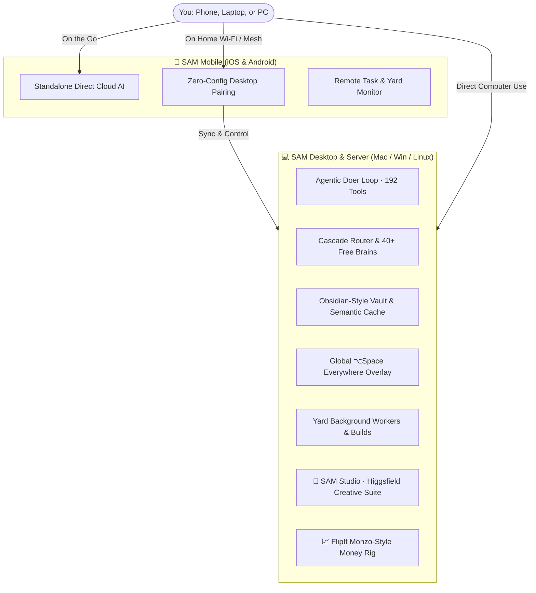

<div align="center">

# ⚡ S.A.M. — Smart Artificial Mind

**The Private, High-Speed AI Agent & Multi-Device OS.**
*Runs standalone on your phone or locally on your computer with 40+ auto-rotating free AI brains. Zero subscriptions. 100% private.*

<p align="center">
  
  
  
  
  
  
  
</p>

```bash
curl -fsSL https://raw.githubusercontent.com/richhabits/sam/main/docs/install.sh | bash
```
**macOS · Linux · Windows (one-click / one-paste)** — [See Platform Matrix](docs/PLATFORMS.md)

</div>

---

## 🌟 The Complete SAM Ecosystem


```mermaid
graph TD
    User([You: Phone, Laptop, or PC])
    
    subgraph Mobile ["📱 SAM Mobile (iOS & Android)"]
        MobileAI[Standalone Direct Cloud AI]
        MobilePair[Zero-Config Desktop Pairing]
        MobileYard[Remote Task & Yard Monitor]
    end
    
    subgraph Core ["💻 SAM Desktop & Server (Mac / Win / Linux)"]
        Agent[Agentic Doer Loop · 192 Tools]
        Cascade[Cascade Router & 40+ Free Brains]
        Memory[Obsidian-Style Vault & Semantic Cache]
        Overlay[Global ⌥Space Everywhere Overlay]
        Yard[Yard Background Workers & Builds]
        Studio[🎨 SAM Studio · Higgsfield Creative Suite]
        FlipIt[📈 FlipIt Monzo-Style Money Rig]
    end

    User -->|On the Go| MobileAI
    User -->|On Home Wi-Fi / Mesh| MobilePair
    MobilePair -->|Sync & Control| Core
    User -->|Direct Computer Use| Core
```

---

## 🚀 Key Superpowers

### 📱 1. Standalone Mobile + Seamless Desktop Link
* **Works Anywhere Instantly**: Download SAM on iOS or Android and chat directly with high-speed AI out-of-the-box. No Mac required.
* **Hybrid Desktop Pairing**: When on your home Wi-Fi or VPN, SAM automatically pairs with your computer to run local terminal commands, edit code, index files, and monitor background tasks.
* **Zero Disconnection Errors**: If your computer goes to sleep or you're away on 5G, SAM seamlessly falls back to cloud AI without breaking the conversation.

### 🎨 2. SAM Studio (Higgsfield-Style Creative Workspace)
* **Free-First Image & Video Generation**: Powered by multi-provider matrix (Pollinations, Together, HF, NVIDIA, Cloudflare).
* **Same-Origin Media Vault**: Automatically caches generations to your local vault so image and video links never rot or break.
* **Notebooks & Grounded Audio Overviews**: Upload PDFs, notes, or web links to generate instant audio briefings and grounded Q&A.

### 📈 3. FlipIt & The Money Desk
* **Monzo-Style Automated Rig**: Real-time watchdog monitoring schedules, forward steps, and daily execution metrics.
* **Resilient Watchdog**: Detects stale loops, calendar shifts (GMT/BST), and guarantees automated step execution.

### 🧠 4. Cascade Router & 40+ Free AI Brains
* **Free-First Auto-Rotation**: Groq · Cerebras · NVIDIA · DeepSeek · Gemini · Mistral · SambaNova · Together · Fireworks · Ollama.
* **Zero Cost**: Automatically falls through to the fastest available free model. If one hits a rate limit, it hops to the next in sub-milliseconds.
* **Sub-Millisecond Semantic Cache**: Repeated questions answer from memory in ~2ms with 0 token cost.

### 🛠️ 5. The Doer (192 Real Computer Tools)
* Not just text generation. SAM executes bash scripts, edits files with syntax auto-verification, commits to Git, inspects browsers, manages scheduled tasks, and runs multi-agent parallel swarms.

---

## ⚡ Quick Start

### 🖥️ Desktop (macOS / Linux / Windows)

#### Option A: One-Paste Install (Recommended)
* **macOS & Linux:**
  ```bash
  curl -fsSL https://raw.githubusercontent.com/richhabits/sam/main/docs/install.sh | bash
  ```
* **Windows (PowerShell):**
  ```powershell
  irm https://raw.githubusercontent.com/richhabits/sam/main/docs/install.ps1 | iex
  ```

#### Option B: Run from Source
```bash
git clone https://github.com/richhabits/sam.git
cd sam
npm install
cp .env.example .env
npm start
```
Open **http://localhost:8787** — free and ready immediately.

---

### 📱 Mobile (iOS & Android)

* **iOS**: Available via TestFlight / App Store.
* **Android**: Build APK or run locally via `cd mobile && npx expo run:android`.
* **Pairing**: In SAM Desktop, go to **Dashboard → Devices → Pair a phone** and scan the QR code with your phone camera.

---

## 📊 SAM vs. The Rest

| Feature | **SAM** | ChatGPT Desktop | Claude Desktop |
|---|:---:|:---:|:---:|
| **Monthly Cost** | **Free (£0/mo)** | $20/mo | $20/mo |
| **Mobile Standalone + Desktop Sync** | **✅ Full Hybrid** | ❌ Separate | ❌ Separate |
| **Multi-Agent Swarm** | **✅ Parallel Crew** | ❌ Single Turn | ❌ Single Turn |
| **Local Tools & Yard Workers** | **✅ 192 Real Tools** | ⚠️ Sandboxed | ⚠️ MCP Only |
| **Offline Brain Support** | **✅ Ollama / Local** | ❌ Cloud only | ❌ Cloud only |
| **Data Privacy** | **✅ 100% On-Device** | ❌ Sent to OpenAI | ❌ Sent to Anthropic |
| **Creative Studio & FlipIt** | **✅ Built-in** | ❌ | ❌ |

---

## 🔒 Privacy & Architecture

* All memories, chats, and vault notes are stored in human-readable Markdown on your local disk (`vault/`).
* API keys are stored securely in your local environment / Keychain and never shared.
* Full offline mode available with local Ollama models.

---

<div align="center">
  <b>Built by HECTIC · Open, Free, and Unstoppable.</b>
</div>
