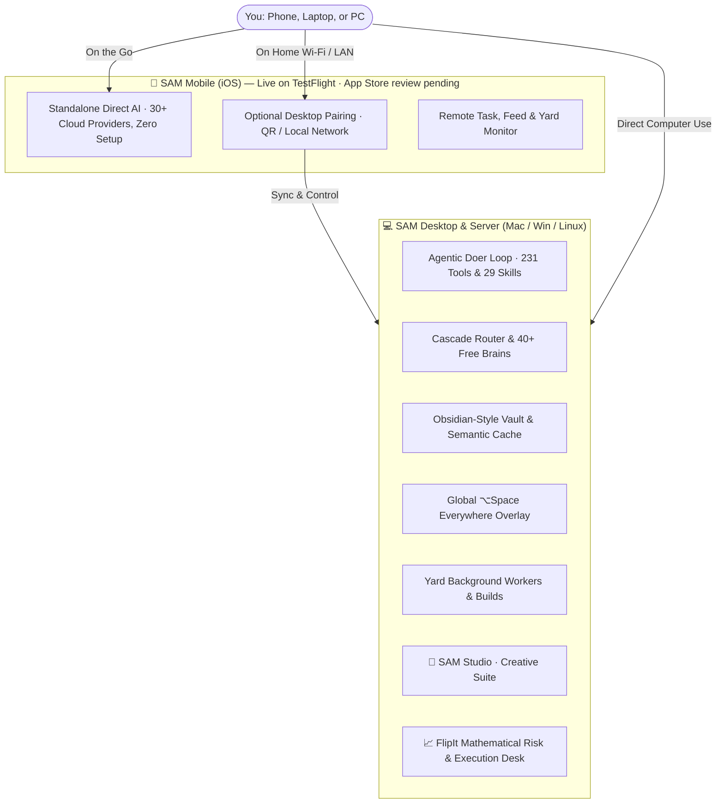

<div align="center">

# ⚡ S.A.M. — Smart Artificial Mind

**The Private, High-Speed AI Agent & Multi-Device OS.**
*Runs standalone on your phone or locally on your computer with 40+ auto-rotating free AI brains. Zero subscriptions. 100% private.*

<p align="center">
  
  
  
  
  
  
  
  
</p>

```bash
# macOS & Linux One-Liner
curl -fsSL https://raw.githubusercontent.com/richhabits/sam/main/docs/install.sh | bash
```

```powershell
# Windows (PowerShell) One-Liner
irm https://raw.githubusercontent.com/richhabits/sam/main/docs/install.ps1 | iex
```

**macOS · Windows · Linux (one-click / one-paste)** — [See Platform Matrix](docs/PLATFORMS.md)

</div>

---

## 🌟 The Complete SAM Ecosystem


```mermaid
graph TD
    User([You: Phone, Laptop, or PC])
    
    subgraph Mobile ["📱 SAM Mobile (iOS) — Live on TestFlight · App Store review pending"]
        MobileAI[Standalone Direct AI · 30+ Cloud Providers, Zero Setup]
        MobilePair[Optional Desktop Pairing · QR / Local Network]
        MobileYard[Remote Task, Feed & Yard Monitor]
    end
    
    subgraph Core ["💻 SAM Desktop & Server (Mac / Win / Linux)"]
        Agent[Agentic Doer Loop · 231 Tools & 29 Skills]
        Cascade[Cascade Router & 40+ Free Brains]
        Memory[Obsidian-Style Vault & Semantic Cache]
        Overlay[Global ⌥Space Everywhere Overlay]
        Yard[Yard Background Workers & Builds]
        Studio[🎨 SAM Studio · Creative Suite]
        FlipIt[📈 FlipIt Mathematical Risk & Execution Desk]
    end

    User -->|On the Go| MobileAI
    User -->|On Home Wi-Fi / LAN| MobilePair
    MobilePair -->|Sync & Control| Core
    User -->|Direct Computer Use| Core
```

---

## 🚀 Key Superpowers

### 🧠 1. Cascade Router & 40+ Free AI Brains
* **Free-First Auto-Rotation**: Groq · Cerebras · NVIDIA NIM · DeepSeek · Gemini · Mistral · SambaNova · Together · Fireworks · Ollama.
* **Zero Cost**: Automatically falls through to the fastest available free model. If one hits a rate limit, it hops to the next in sub-milliseconds.
* **Sub-Millisecond Semantic Cache**: Repeated questions answer from local memory in ~2ms with 0 token cost.

### 🛠️ 2. The Doer (231 Real Computer Tools & 29 Skills)
* Not just text generation. SAM executes terminal commands, edits code with syntax validation, commits to Git, inspects browsers, manages scheduled cron tasks, and orchestrates multi-agent parallel swarms.
* **Universal Cross-Platform**: 213 universal tools running identically on macOS, Windows, and Linux, with 18 specialized macOS platform hooks that degrade gracefully.

### 🎨 3. SAM Studio (Creative Suite)
* **Free-First Image & Video Generation**: Powered by a multi-provider matrix (Pollinations, Together, HuggingFace, NVIDIA, Cloudflare).
* **Persistent Media Vault**: Automatically stores generated visual assets in your local vault with persistent preview styles.
* **Notebooks & Audio Briefings**: Upload PDFs, notes, or web links to generate grounded audio overviews and interactive citations.

### 📈 4. FlipIt & The Financial Execution Desk
* **Mathematical Kelly Criterion Engine**: Automated capital allocation and real-time risk regime calculation (`POST /api/flipit/shield`).
* **Resilient Watchdogs**: Continuous schedule monitoring, forward execution metrics, and market data telemetry.

### 📱 5. Mobile (iOS) — *Live on TestFlight, App Store review submitted*
* **100% Standalone, Zero Setup**: Chat immediately on install — no pairing, no account. Routes through 30+ direct cloud AI providers (Groq, Cerebras, Mistral, Gemini, Anthropic, DeepSeek, and more), each addable with your own free key in Settings.
* **Optional Desktop Link**: Pair with your Mac/PC over local network to unlock local files, automation, and yard workers — never required, only unlocked when you want it.
* **Native Feel**: Haptics throughout, 1-tap code copy/share, live connection status, and an honest fallback if every AI lane genuinely fails — SAM never fabricates a response.

---

## ⚡ Quick Start & Downloads

### 🖥️ Desktop (macOS / Windows / Linux)

#### Option A: One-Paste Terminal Install (Recommended)

* **macOS (Apple Silicon & Intel) & Linux:**
  ```bash
  curl -fsSL https://raw.githubusercontent.com/richhabits/sam/main/docs/install.sh | bash
  ```

* **Windows (PowerShell 5.1+ / Windows Terminal):**
  ```powershell
  irm https://raw.githubusercontent.com/richhabits/sam/main/docs/install.ps1 | iex
  ```

#### Option B: Standalone Release Installers
Download the latest binaries directly from the [GitHub Releases](https://github.com/richhabits/sam/releases/latest) page:
* **macOS**: `SAM-x.x.x-arm64.dmg` (Apple Silicon M1/M2/M3/M4) or `SAM-x.x.x.dmg` (Intel)
* **Windows**: `SAM-Setup-x.x.x.exe`
* **Linux**: `SAM-x.x.x.AppImage` or `SAM-x.x.x.deb`

#### Option C: Run from Source (Developers)
```bash
git clone https://github.com/richhabits/sam.git
cd sam
npm install
cp .env.example .env
npm start
```
Open **http://localhost:8787** — free, local, and ready immediately.

---

### 📱 Mobile App (iOS)

> **Status: Live on TestFlight · Submitted for App Store review**

* **Try it now**: [Join the TestFlight beta](https://testflight.apple.com/join/htr4htvY) — works immediately, standalone, no desktop required.
* **App Store**: Submitted and awaiting Apple's review; this README will be updated the moment it's live.
* **Android**: Not yet started.
* **Optional desktop pairing**: In the app, tap **Connect to Mac / PC** (or in SAM Desktop, **Dashboard → Devices → Pair a phone**) to unlock local files and automation — entirely optional.

---

## 📊 SAM vs. The Rest

| Feature | **SAM** | ChatGPT Desktop | Claude Desktop |
|---|:---:|:---:|:---:|
| **Monthly Cost** | **Free (£0/mo)** | $20/mo | $20/mo |
| **Mobile Standalone + Desktop Sync** | **✅ Full Hybrid** | ❌ Separate | ❌ Separate |
| **Multi-Agent Swarms** | **✅ Parallel Crew** | ❌ Single Turn | ❌ Single Turn |
| **Local Tools & Yard Workers** | **✅ 231 Real Tools** | ⚠️ Sandboxed | ⚠️ MCP Only |
| **Offline Brain Support** | **✅ Ollama / Local** | ❌ Cloud only | ❌ Cloud only |
| **Data Privacy** | **✅ 100% On-Device** | ❌ Cloud storage | ❌ Cloud storage |
| **Creative Studio & FlipIt** | **✅ Built-in** | ❌ | ❌ |

---

## 🔒 Privacy & Local-First Architecture

* All chats, memories, and vault artifacts are stored as plain Markdown & SQLite files in your local workspace (`vault/`).
* API keys are stored strictly in your local environment / OS Keychain and never sent to external telemetry servers.
* Full offline capability supported with local Ollama models (e.g. `llama3.2:3b`, `qwen2.5-coder`).

---

<div align="center">
  <b>Built by HECTIC · Open, Free, and Yours.</b>
</div>

