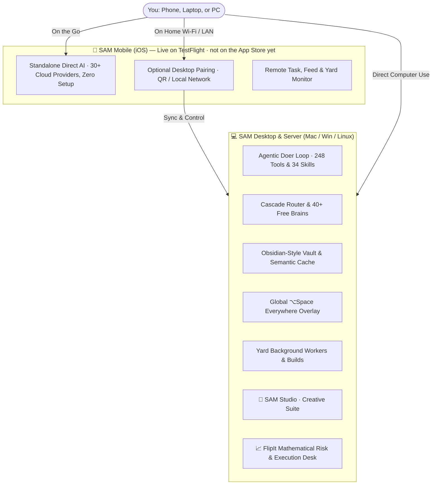

<div align="center">

# ⚡ S.A.M. — Smart Artificial Mind

**The Private, High-Speed AI Agent & Multi-Device OS.**
*Runs standalone on your phone or locally on your computer with 40+ auto-rotating free AI brains. No subscription. Your files and memory stay on your machine; free AI models are cloud-hosted, so what you type goes to the model you pick (or stays fully local with Ollama).*

<p align="center">
  
  
  
  
  
  
  
  
</p>

```bash
# macOS & Linux One-Liner
curl -fsSL https://raw.githubusercontent.com/richhabits/sam/main/docs/install.sh | bash
```

```powershell
# Windows (PowerShell) One-Liner
irm https://raw.githubusercontent.com/richhabits/sam/main/docs/install.ps1 | iex
```

**macOS · Windows · Linux (one-click / one-paste)** — [See Platform Matrix](docs/PLATFORMS.md)

</div>

---

## 🌟 The Complete SAM Ecosystem


```mermaid
graph TD
    User([You: Phone, Laptop, or PC])
    
    subgraph Mobile ["📱 SAM Mobile (iOS) — Live on TestFlight · not on the App Store yet"]
        MobileAI[Standalone Direct AI · 30+ Cloud Providers, Zero Setup]
        MobilePair[Optional Desktop Pairing · QR / Local Network]
        MobileYard[Remote Task, Feed & Yard Monitor]
    end
    
    subgraph Core ["💻 SAM Desktop & Server (Mac / Win / Linux)"]
        Agent[Agentic Doer Loop · 248 Tools & 34 Skills]
        Cascade[Cascade Router & 40+ Free Brains]
        Memory[Obsidian-Style Vault & Semantic Cache]
        Overlay[Global ⌥Space Everywhere Overlay]
        Yard[Yard Background Workers & Builds]
        Studio[🎨 SAM Studio · Creative Suite]
        FlipIt[📈 FlipIt Mathematical Risk & Execution Desk]
    end

    User -->|On the Go| MobileAI
    User -->|On Home Wi-Fi / LAN| MobilePair
    MobilePair -->|Sync & Control| Core
    User -->|Direct Computer Use| Core
```

---

## 🚀 Key Superpowers

### 🧠 1. Cascade Router & 40+ Free AI Brains
* **Free-First Auto-Rotation**: Groq · Cerebras · NVIDIA NIM · DeepSeek · Gemini · Mistral · SambaNova · Together · Fireworks · Ollama.
* **No cost by default**: it uses free models first, and if one hits its limit it switches to the next free one. Paid models (Anthropic, OpenAI) are used only if you add your own key and choose them.
* **Answer cache**: repeated questions are answered from local memory — instantly, and with no AI call to pay for.

### 🛠️ 2. The Doer (248 Real Computer Tools & 34 Skills)
* Not just text generation. SAM executes terminal commands, edits code with syntax validation, commits to Git, inspects browsers, manages scheduled cron tasks, and orchestrates multi-agent parallel swarms.
* **Universal Cross-Platform**: 230 tools that work the same on macOS, Windows, and Linux, plus 18 macOS-only tools that tell you politely when they are unavailable elsewhere.

### 🎨 3. SAM Studio (Creative Suite)
* **Free-First Image & Video Generation**: Powered by a multi-provider matrix (Pollinations, Together, HuggingFace, NVIDIA, Cloudflare).
* **Persistent Media Vault**: Automatically stores generated visual assets in your local vault with persistent preview styles.
* **Notebooks & Audio Briefings**: Upload PDFs, notes, or web links to generate grounded audio overviews and interactive citations.

### 📈 4. FlipIt & The Financial Execution Desk
* **Position-sizing calculator (Kelly criterion)**: works out how much to stake, plus a live read on market risk. It is a calculator, not financial advice and not a promise of profit (`POST /api/flipit/shield`).
* **Watchdogs**: keeps an eye on scheduled jobs and market data. Trading carries real risk of loss.

### 📱 5. Mobile (iOS) — *Live on TestFlight, not on the App Store yet*
* **Works on its own, no setup**: chat straight after install — no pairing, no account. It uses free public AI lanes, or any of 30+ providers (Groq, Cerebras, Mistral, Gemini, DeepSeek and more) with your own free key in Settings. Anthropic and OpenAI are paid, and used only with your own key.
* **Optional Desktop Link**: Pair with your Mac/PC over local network to unlock local files, automation, and yard workers — never required, only unlocked when you want it.
* **Native Feel**: Haptics throughout, 1-tap code copy/share, live connection status, and an honest fallback if every AI lane genuinely fails — SAM never fabricates a response.

---

## ⚡ Quick Start & Downloads

### 🖥️ Desktop (macOS / Windows / Linux)

#### Option A: One-Paste Terminal Install (Recommended)

* **macOS (Apple Silicon; Intel uses source until an Intel `.dmg` ships) & Linux:**
  ```bash
  curl -fsSL https://raw.githubusercontent.com/richhabits/sam/main/docs/install.sh | bash
  ```

* **Windows (PowerShell 5.1+ / Windows Terminal):**
  ```powershell
  irm https://raw.githubusercontent.com/richhabits/sam/main/docs/install.ps1 | iex
  ```

#### Option B: Standalone Release Installers
Download the latest binaries directly from the [GitHub Releases](https://github.com/richhabits/sam/releases/latest) page:
* **macOS**: `SAM-x.x.x-arm64.dmg` (Apple Silicon). **Intel `.dmg` is not in the current release** — `install.sh` refuses to install the arm64 image on Intel; use Option C (from source) until that asset exists.
* **Signed vs unsigned:** a notarized Developer ID build opens with Gatekeeper `accepted` (this Mac's 3.6.0 is `source=Notarized Developer ID`). If Gatekeeper cannot verify, the installer says so and clears quarantine — that is the honest unsigned path, not a silent skip. Overlay (⌥Space) and the Dock icon come from **SAM.app**, not from the browser HUD.
* **Windows**: `SAM-Setup-x.x.x.exe` (v3.6.0: `SAM-Setup-3.6.0.exe`). One-paste: `docs/install.ps1`. From source: `setup.ps1` + `START-SAM.bat` (no `.sh`). The packaged app starts the yard worker; SmartScreen “More info → Run anyway” is the unsigned path.
* **Linux (x64)**: `SAM-x.x.x.AppImage` (default one-paste → `~/.local/bin/SAM.AppImage`) or `sam_x.x.x_amd64.deb` (`SAM_PKG=deb`). No arm64 Linux build in the current release — `install.sh` says so instead of handing you the amd64 image. Needs `libfuse2` on some Ubuntu 22+ boxes.

#### Option C: Run from Source (Developers)
```bash
git clone https://github.com/richhabits/sam.git
cd sam
npm install
cp .env.example .env
npm start
```
Open **http://localhost:8787** — free, local, and ready immediately. Opening the HUD on this computer pairs that browser tab (chat, tools, and settings work). A phone or another machine still uses the pairing link SAM prints on start.

---

### 📱 Mobile App (iOS)

> **Status: Live on TestFlight · App Store not live yet (review notes are in `mobile/SUBMISSION.md`; this session did not press Submit)**

* **Try it now**: [Join the TestFlight beta](https://testflight.apple.com/join/htr4htvY) — works immediately, standalone, no desktop required.
* **App Store**: Not on the store yet. TestFlight is the shipping iOS binary. Widget reads App Group `group.com.hectic.sam.mobile` (pairing / yard snapshot from the app) — needs a new native build to land on devices.
* **Android**: Same Expo app as iOS (`com.hectic.sam.mobile`). **Not on Play Store.** Debug APK builds: `cd mobile/android && ./gradlew assembleDebug` → `app/build/outputs/apk/debug/app-debug.apk` (proved this session, 156MB, minSdk 24). Sideload; demo mode works with no desktop. The platforms badge does not claim Play Store.
* **Optional desktop pairing**: In the app, tap **Connect to Mac / PC** (or in SAM Desktop, **Dashboard → Devices → Pair a phone**) to unlock local files and automation — entirely optional.

---

## 📊 SAM vs. The Rest

_A general comparison, as of 2026. Their products change often — check their current plans._

| Feature | **SAM** | ChatGPT Desktop | Claude Desktop |
|---|:---:|:---:|:---:|
| **Monthly Cost** | **£0 for SAM** (paid AI models are optional, your own key) | paid plans from about $20/mo | paid plans from about $20/mo |
| **Mobile Standalone + Desktop Sync** | **✅ Full Hybrid** | Separate apps | Separate apps |
| **Multi-Agent Swarms** | **✅ Parallel Crew** | Varies by plan | Varies by plan |
| **Local Tools & Yard Workers** | **✅ 248 Real Tools** | Different approach | Different approach |
| **Offline Brain Support** | **✅ Ollama / Local** | ❌ Cloud only | ❌ Cloud only |
| **Data Privacy** | **Files and memory stay on your machine** (chat text goes to the AI model you pick; fully local with Ollama) | Cloud-hosted | Cloud-hosted |
| **Creative Studio & FlipIt** | **✅ Built-in** | ❌ | ❌ |

---

## 🔒 Privacy & Local-First Architecture

* All chats, memories, and vault artifacts are stored as plain Markdown & SQLite files in your local workspace (`vault/`).
* API keys are stored in your local environment file on your machine. They are sent only to the AI provider they belong to. Anonymous usage counts are off unless you opt in (see `docs/PRIVACY.md`).
* Full offline capability supported with local Ollama models (e.g. `llama3.2:3b`, `qwen2.5-coder`).

---

<div align="center">
  <b>Built by HECTIC · Source-available, free to use, and yours.</b>
</div>

